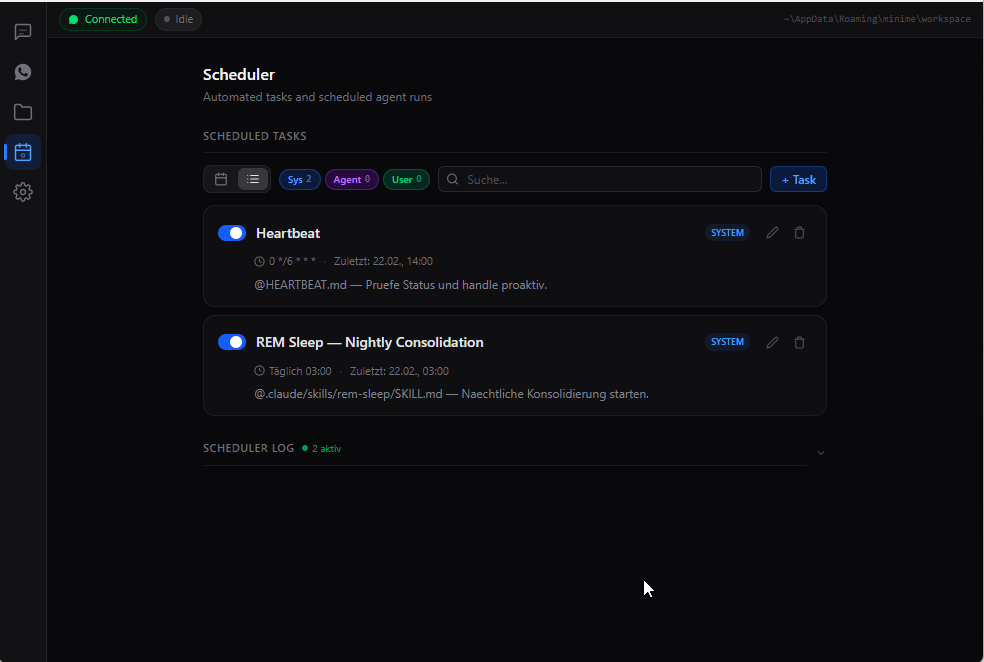

<div align="center">

# miniMe

**Your autonomous personal AI assistant — powered by Claude Code**

Self-hosted, private, always-on. Talk to your agent via WhatsApp or the built-in UI.
It learns, remembers, and acts proactively on your behalf.

[English](#user-guide) | [Deutsch](#bedienungsanleitung)

</div>

---

# User Guide

## Prerequisites

- An [Anthropic API key](https://console.anthropic.com/) (set as `ANTHROPIC_API_KEY` environment variable)
- [Claude Code CLI](https://docs.anthropic.com/en/docs/claude-code) installed and authenticated
- WhatsApp account (optional — for mobile access)

## Installation

Download the latest release for your platform:

- **Windows**: `minime-x.x.x-setup.exe` (NSIS installer)
- **Linux**: `minime-x.x.x-x64.AppImage` or `.deb`

Or build from source:
```bash
git clone https://github.com/sabania/miniMe.git
cd miniMe
npm install
npm run build:win    # or build:linux
```

## First Start

On the very first launch, the workspace is empty and a **language dialog** appears:

1. Choose **Deutsch** or **English** — this sets the language for all agent templates (identity, memory structure, skills)
2. The workspace is created with your chosen language
3. This choice is permanent — to change it later, use the Workspace Reset in the Danger Zone

> The language setting controls the agent's internal templates and communication style. It does **not** affect the UI (which is always in English).

## Sessions

<p align="center">
  
</p>

The Sessions tab is where you interact with your agent.

- **+ New** creates a new conversation
- Messages from WhatsApp and the UI appear in the same timeline
- The header shows: status (Active/Closed), start time, duration, and accumulated cost
- **Terminal** opens Claude Code in a separate terminal for the same session
- **Code** opens VS Code in the session's working directory
- **Files** opens the workspace folder

### Permission Requests

<p align="center">
  
</p>

When the agent wants to use a tool (e.g. WebSearch, file edits, bash commands), a permission prompt appears:

- **Allow** — approve this specific action
- **Deny** — block this action, agent will try an alternative

The orange badge on the Sessions icon in the sidebar indicates a pending permission. To avoid constant prompts, change the Permission Mode in Settings.

## WhatsApp

<p align="center">
  
</p>

1. Click **Connect** — a QR code appears
2. Open WhatsApp on your phone → Linked Devices → Link a Device
3. Scan the QR code
4. Once connected, the status bar shows **Connected** in green

Now you can message the agent from your phone. It will respond autonomously. The **Response Mode** in Settings controls how:

| Mode | Behavior |
|------|----------|
| **sendMessage** | Agent decides what to send via the MCP tool — more deliberate |
| **Streaming** | All assistant text is forwarded immediately as it's generated |

### Contacts

Add contacts on the WhatsApp page so the agent knows who it's talking to. Mark one contact as **Owner** — that's you. The agent uses this for its user profile.

## Settings

<p align="center">
  
</p>

### Agent

| Setting | Options | What it does |
|---------|---------|-------------|
| **Permission Mode** | Ask, Accept Edits, Bypass, Plan | Controls how much autonomy the agent has |
| **Model** | Default, Sonnet, Haiku | Which Claude model to use |

**Permission Modes explained:**

| Mode | Description |
|------|-------------|
| **Ask** | Agent asks before every tool call — maximum control |
| **Accept Edits** | File edits are auto-approved, everything else asks |
| **Bypass** | Fully autonomous — no prompts at all |
| **Plan** | Read-only analysis mode — agent can only read, not modify |

### WhatsApp

| Setting | What it does |
|---------|-------------|
| **Auto-Connect** | Automatically connect WhatsApp when the app starts |
| **Response Mode** | sendMessage (deliberate) or Streaming (real-time) |

### Application

| Setting | What it does |
|---------|-------------|
| **Minimize to Tray** | Close button hides to system tray instead of quitting |
| **Start with System** | Launch automatically on login |
| **Use Git** | Track workspace and project changes with git |
| **Version** | Current version + check for updates |
| **Workspace** | Path to the workspace folder (click to copy, Open to browse) |

## Scheduler

<p align="center">
  
</p>

The scheduler runs tasks automatically on a schedule. Two system tasks are pre-configured:

| Task | Schedule | Purpose |
|------|----------|---------|
| **Heartbeat** | Every few hours (07:00–23:00) | Agent checks for pending items, new files, deadlines |
| **REM Sleep** | Daily at 03:00 | Nightly memory consolidation — deduplicate, clean up, plan ahead |

<p align="center">
  
</p>

Switch between **Calendar** and **List** view. Filter by type: **Sys** (system), **Agent** (created by the agent), **User** (created by you).

### Creating Tasks

<p align="center">
  
</p>

Click **+ Task** to create a new scheduled task:

1. **Name** — a descriptive title
2. **Prompt** — what the agent should do when the task fires
3. **Frequency** — One-time, Daily, Weekly, Interval, or raw Cron expression
4. **Start Date & Time** — when to begin

The agent can also create its own tasks via the scheduler MCP tool.

## Projects

Link local folders as projects so the agent can access them:

1. Go to the **Projects** tab
2. Click **+ Project** and select a folder
3. The folder appears as a junction in `workspace/projects/`

The agent can then navigate to projects, read/write files, and run commands. Each project gets its own git tracking (if enabled).

## How the Agent Learns

miniMe uses a **Second Brain** architecture. Everything the agent learns is stored in the workspace:

```
workspace/
├── SOUL.md              # Agent identity — who it is, how it communicates
├── HEARTBEAT.md         # Instructions for proactive checks
├── memory/
│   ├── CLAUDE.md        # Main index — routing table for all knowledge
│   ├── user/            # What it knows about you
│   ├── people/          # People in your life
│   ├── projects/        # Project knowledge
│   ├── decisions/       # Decision log
│   ├── ideas/           # Ideas & notes inbox
│   └── journal/         # Weekly notes & tasks
└── .claude/skills/      # Built-in skills (memory, contacts, tasks, etc.)
```

The agent updates its memory continuously:
- **During conversations** — new facts are saved immediately
- **PreCompact** (context getting full) — important things are saved before compression
- **REM Sleep** (nightly) — full consolidation, cleanup, and planning

All changes are git-tracked, so you can see what the agent learned over time.

## Danger Zone

In Settings, scroll to the bottom and expand **Danger Zone** to reset components:

| Reset | What it clears |
|-------|---------------|
| **Settings** | All config back to defaults (app reloads) |
| **Conversations** | All chat history and messages |
| **Scheduler** | All tasks (system tasks are re-created) |
| **Workspace** | Memory, templates, tmp/ — **language dialog reappears** |
| **WhatsApp** | Disconnect + delete credentials (re-scan QR needed) |

Select one or more, then confirm. Selecting all performs a **Full Reset**.

> **Workspace Reset** deletes the agent's entire memory and re-scaffolds from scratch. You'll be asked to choose the language again.

---

# Bedienungsanleitung

## Voraussetzungen

- Ein [Anthropic API Key](https://console.anthropic.com/) (als `ANTHROPIC_API_KEY` Umgebungsvariable gesetzt)
- [Claude Code CLI](https://docs.anthropic.com/en/docs/claude-code) installiert und authentifiziert
- WhatsApp-Account (optional — fuer mobilen Zugriff)

## Installation

Lade das neueste Release fuer deine Plattform herunter:

- **Windows**: `minime-x.x.x-setup.exe` (NSIS Installer)
- **Linux**: `minime-x.x.x-x64.AppImage` oder `.deb`

Oder selbst bauen:
```bash
git clone https://github.com/sabania/miniMe.git
cd miniMe
npm install
npm run build:win    # oder build:linux
```

## Erster Start

Beim allerersten Start ist der Workspace leer und ein **Sprachwahl-Dialog** erscheint:

1. Waehle **Deutsch** oder **English** — das legt die Sprache fuer alle Agent-Templates fest (Identitaet, Memory-Struktur, Skills)
2. Der Workspace wird mit der gewaehlten Sprache erstellt
3. Diese Wahl ist dauerhaft — um sie spaeter zu aendern, nutze den Workspace-Reset in der Danger Zone

> Die Spracheinstellung steuert die internen Templates und den Kommunikationsstil des Agents. Die UI selbst ist immer auf Englisch.

## Sessions

<p align="center">
  
</p>

Im Sessions-Tab interagierst du mit deinem Agent.

- **+ New** erstellt eine neue Konversation
- Nachrichten von WhatsApp und der UI erscheinen in der gleichen Timeline
- Der Header zeigt: Status (Active/Closed), Startzeit, Dauer und aufgelaufene Kosten
- **Terminal** oeffnet Claude Code in einem separaten Terminal fuer dieselbe Session
- **Code** oeffnet VS Code im Arbeitsverzeichnis der Session
- **Files** oeffnet den Workspace-Ordner

### Permission Requests

<p align="center">
  
</p>

Wenn der Agent ein Tool nutzen will (z.B. WebSearch, Datei-Edits, Bash-Befehle), erscheint ein Permission-Prompt:

- **Allow** — diese spezifische Aktion genehmigen
- **Deny** — blockieren, Agent versucht eine Alternative

Das orange Badge am Sessions-Icon in der Sidebar zeigt eine ausstehende Permission an. Um staendige Prompts zu vermeiden, aendere den Permission Mode in den Settings.

## WhatsApp

<p align="center">
  
</p>

1. Klicke **Connect** — ein QR-Code erscheint
2. Oeffne WhatsApp auf dem Handy → Verknuepfte Geraete → Geraet verknuepfen
3. QR-Code scannen
4. Sobald verbunden, zeigt die Statusleiste **Connected** in Gruen

Jetzt kannst du dem Agent vom Handy schreiben. Er antwortet autonom. Der **Response Mode** in den Settings steuert wie:

| Modus | Verhalten |
|-------|-----------|
| **sendMessage** | Agent entscheidet gezielt was er sendet — ueberlegter |
| **Streaming** | Aller Assistant-Text wird sofort weitergeleitet |

### Kontakte

Fuege Kontakte auf der WhatsApp-Seite hinzu, damit der Agent weiss mit wem er spricht. Markiere einen Kontakt als **Owner** — das bist du. Der Agent nutzt das fuer sein User-Profil.

## Settings

<p align="center">
  
</p>

### Agent

| Einstellung | Optionen | Was es tut |
|-------------|----------|-----------|
| **Permission Mode** | Ask, Accept Edits, Bypass, Plan | Steuert wie viel Autonomie der Agent hat |
| **Model** | Default, Sonnet, Haiku | Welches Claude-Modell verwendet wird |

**Permission Modes erklaert:**

| Modus | Beschreibung |
|-------|-------------|
| **Ask** | Agent fragt vor jedem Tool-Aufruf — maximale Kontrolle |
| **Accept Edits** | Datei-Edits werden automatisch genehmigt, alles andere fragt |
| **Bypass** | Voll autonom — keine Prompts |
| **Plan** | Nur-Lesen-Modus — Agent kann nur lesen, nicht aendern |

### WhatsApp

| Einstellung | Was es tut |
|-------------|-----------|
| **Auto-Connect** | WhatsApp automatisch verbinden beim App-Start |
| **Response Mode** | sendMessage (ueberlegt) oder Streaming (Echtzeit) |

### Application

| Einstellung | Was es tut |
|-------------|-----------|
| **Minimize to Tray** | Schliessen-Button minimiert in den System Tray statt zu beenden |
| **Start with System** | Automatisch starten beim Login |
| **Use Git** | Workspace- und Projekt-Aenderungen mit Git tracken |
| **Version** | Aktuelle Version + nach Updates suchen |
| **Workspace** | Pfad zum Workspace-Ordner (Klick zum Kopieren, Open zum Oeffnen) |

## Scheduler

<p align="center">
  
</p>

Der Scheduler fuehrt Tasks automatisch nach Zeitplan aus. Zwei System-Tasks sind vorkonfiguriert:

| Task | Zeitplan | Zweck |
|------|----------|-------|
| **Heartbeat** | Alle paar Stunden (07:00–23:00) | Agent prueft offene Punkte, neue Dateien, Deadlines |
| **REM Sleep** | Taeglich um 03:00 | Naechtliche Memory-Konsolidierung — deduplizieren, aufraeumen, vorausplanen |

<p align="center">
  
</p>

Wechsle zwischen **Kalender-** und **Listenansicht**. Filtere nach Typ: **Sys** (System), **Agent** (vom Agent erstellt), **User** (von dir erstellt).

### Tasks erstellen

<p align="center">
  
</p>

Klicke **+ Task** um einen neuen geplanten Task zu erstellen:

1. **Name** — ein beschreibender Titel
2. **Prompt** — was der Agent tun soll wenn der Task feuert
3. **Frequenz** — Einmal, Taeglich, Woechentlich, Intervall oder roher Cron-Ausdruck
4. **Startdatum & Uhrzeit** — wann es losgehen soll

Der Agent kann auch selbst Tasks ueber das Scheduler-MCP-Tool erstellen.

## Projekte

Verlinke lokale Ordner als Projekte, damit der Agent darauf zugreifen kann:

1. Gehe zum **Projects**-Tab
2. Klicke **+ Project** und waehle einen Ordner
3. Der Ordner erscheint als Junction in `workspace/projects/`

Der Agent kann dann zu Projekten navigieren, Dateien lesen/schreiben und Befehle ausfuehren. Jedes Projekt bekommt eigenes Git-Tracking (wenn aktiviert).

## Wie der Agent lernt

miniMe nutzt eine **Second Brain**-Architektur. Alles was der Agent lernt wird im Workspace gespeichert:

```
workspace/
├── SOUL.md              # Agent-Identitaet — wer er ist, wie er kommuniziert
├── HEARTBEAT.md         # Anleitung fuer proaktive Checks
├── memory/
│   ├── CLAUDE.md        # Hauptindex — Routing-Tabelle fuer alles Wissen
│   ├── user/            # Was er ueber dich weiss
│   ├── people/          # Personen in deinem Leben
│   ├── projects/        # Projekt-Wissen
│   ├── decisions/       # Entscheidungs-Log
│   ├── ideas/           # Ideen & Notizen Inbox
│   └── journal/         # Woechentliche Notizen & Tasks
└── .claude/skills/      # Eingebaute Skills (Memory, Kontakte, Tasks, etc.)
```

Der Agent aktualisiert sein Gedaechtnis kontinuierlich:
- **Waehrend Konversationen** — neue Fakten werden sofort gespeichert
- **PreCompact** (Kontext wird voll) — Wichtiges wird vor der Kompression gesichert
- **REM Sleep** (naechtlich) — volle Konsolidierung, Aufraeumen und Vorausplanung

Alle Aenderungen sind git-getrackt, du kannst also sehen was der Agent ueber die Zeit gelernt hat.

## Danger Zone

In den Settings nach unten scrollen und **Danger Zone** aufklappen um Komponenten zurueckzusetzen:

| Reset | Was geloescht wird |
|-------|--------------------|
| **Settings** | Alle Einstellungen auf Defaults (App laedt neu) |
| **Conversations** | Gesamter Chat-Verlauf und Nachrichten |
| **Scheduler** | Alle Tasks (System-Tasks werden neu erstellt) |
| **Workspace** | Memory, Templates, tmp/ — **Sprachwahl-Dialog erscheint erneut** |
| **WhatsApp** | Trennen + Credentials loeschen (QR neu scannen) |

Einen oder mehrere auswaehlen, dann bestaetigen. Alle auswaehlen fuehrt einen **Full Reset** durch.

> **Workspace Reset** loescht das gesamte Gedaechtnis des Agents und erstellt den Workspace neu. Du wirst erneut nach der Sprache gefragt.
