<div align="center">

# miniMe

**Claude Code — on WhatsApp.**

miniMe wraps Claude Code in a desktop app and connects it to WhatsApp.
Same tools, same permissions, same configuration — just reachable from your phone.

[English](#quick-start) | [Deutsch](#schnellstart)

</div>

---

# Quick Start

## 1. Install Claude Code

miniMe runs [Claude Code](https://code.claude.com/docs/en/setup) under the hood. Install it first:

**Windows PowerShell:**
```powershell
irm https://claude.ai/install.ps1 | iex
```

**macOS / Linux / WSL:**
```bash
curl -fsSL https://claude.ai/install.sh | bash
```

Then authenticate:
```bash
claude
```

Sign in with your [Claude Pro/Max](https://claude.ai/pricing) account or [Anthropic API key](https://console.anthropic.com/).

## 2. Install miniMe

Download the latest release:

- **Windows**: `minime-x.x.x-setup.exe`
- **Linux**: `minime-x.x.x-x64.AppImage` or `.deb`

Or build from source:
```bash
git clone https://github.com/sabania/miniMe.git
cd miniMe
npm install
npm run build:win    # or build:linux
```

On first launch, choose your language (Deutsch / English) — this sets the agent's templates and communication style.

## 3. Connect WhatsApp

<p align="center">
  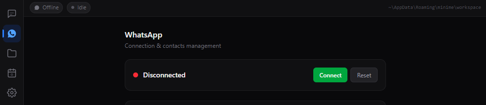
</p>

Click **Connect** in the WhatsApp tab. A QR code appears in the app.

On your phone: **WhatsApp** > **Linked Devices** > **Link a Device** > scan the QR code.

<p align="center">
  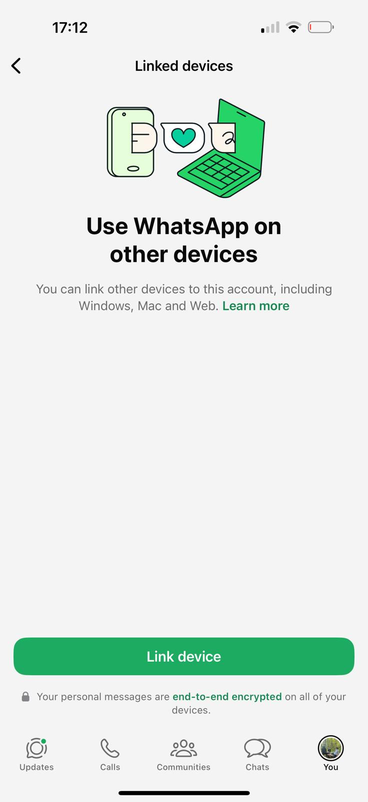
  &nbsp;&nbsp;
  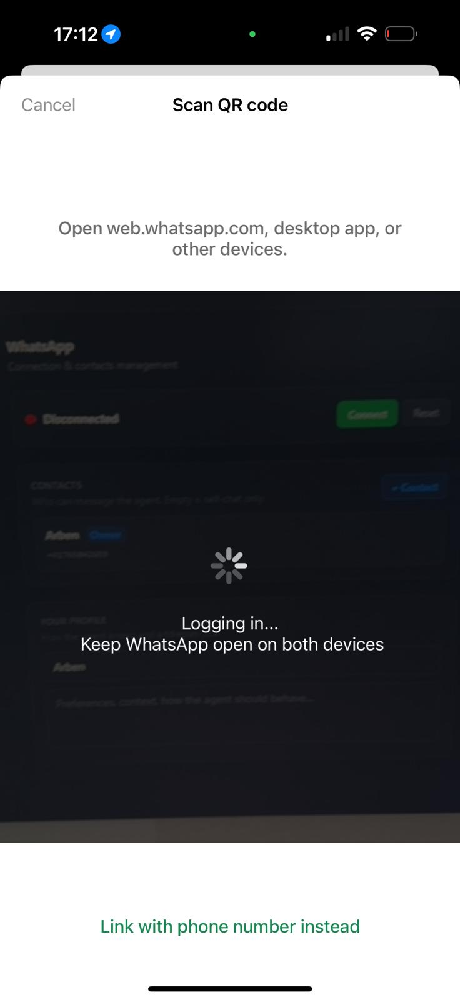
  &nbsp;&nbsp;
  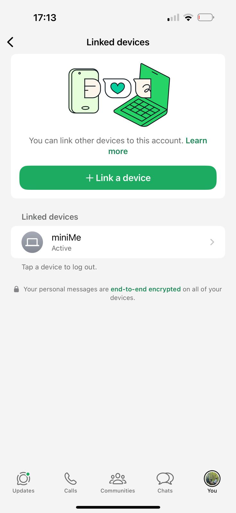
</p>

Done. Send a message and the agent responds.

<p align="center">
  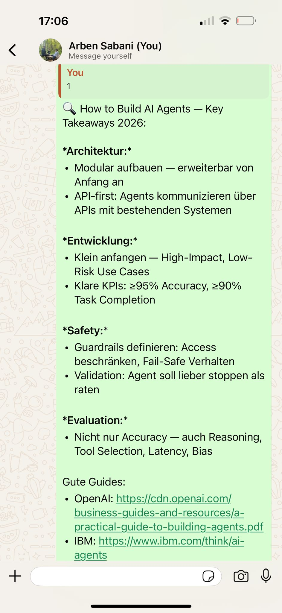
</p>

---

# It's Just Claude Code

miniMe doesn't reinvent anything. It runs the same Claude Code you already use on your terminal — with the same permission system, the same CLAUDE.md files, the same skills, the same settings.

**What miniMe adds:**
- **WhatsApp access** — message your agent from your phone
- **Scheduled tasks** — the agent can work on a schedule (heartbeat checks, nightly consolidation)
- **Persistent sessions** — start on WhatsApp, continue on your PC
- **Desktop app** — manage permissions, sessions, and projects from a UI

**What stays the same:**
- Claude Code's permission system (settings.json, allow/deny rules)
- CLAUDE.md files in your workspace — the agent reads them like any Claude Code session
- Skills in `.claude/skills/` — works exactly like you'd configure on your machine
- All tools (WebSearch, Bash, Read, Write, Edit, etc.) — same as the CLI

You can open the workspace folder, edit CLAUDE.md, add skills, change settings.json — everything works just like configuring Claude Code normally. The agent picks it up on the next run.

---

# What miniMe Adds

## WhatsApp Messaging

Write to the agent from your phone. The Sessions UI shows the full conversation, costs, and status — but WhatsApp is where you talk to it.

<p align="center">
  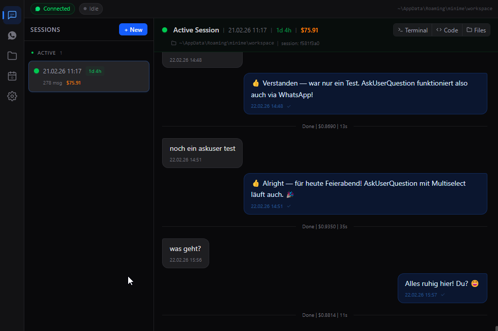
</p>

## Permission Control

When the agent wants to use a tool, it asks — via WhatsApp or the desktop UI. You decide.

<p align="center">
  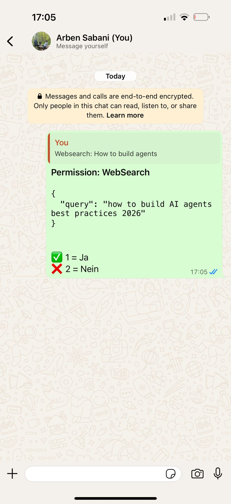
  &nbsp;&nbsp;
  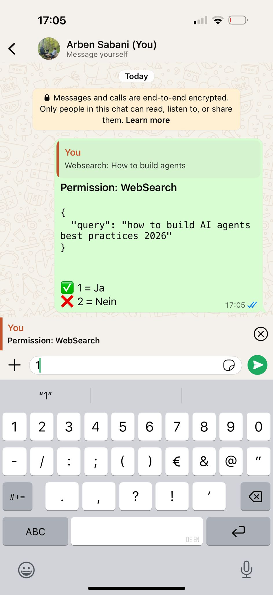
</p>

<p align="center">
  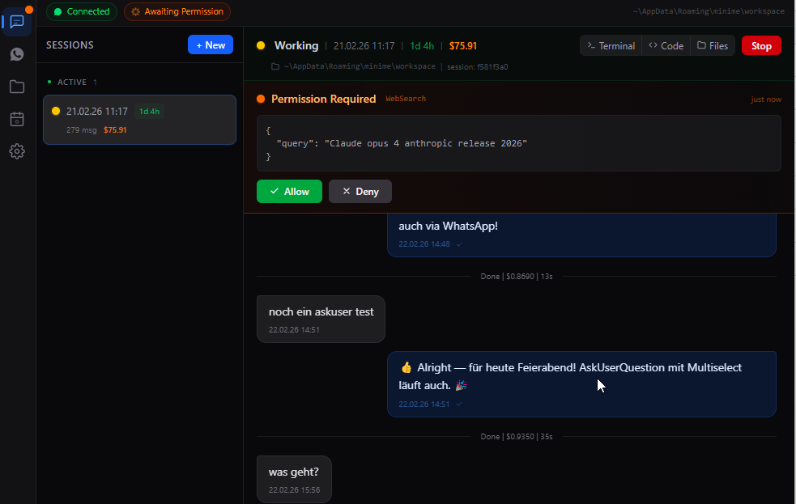
</p>

The **Permission Mode** controls how much autonomy the agent has:

| Mode | Behavior |
|------|----------|
| **Ask** | Agent asks before every tool use — full control |
| **Accept Edits** | File edits auto-approved, other tools ask |
| **Bypass** | Fully autonomous — no prompts at all |
| **Plan** | Read-only — agent can only read, not modify |

This is the same permission system Claude Code uses. `Bypass` is like running `claude --dangerously-skip-permissions`. `Ask` is the default interactive mode. You're in control.

## Continue on Your PC

Every session has a working directory and a session ID. Click **Terminal** in the UI and Claude Code opens in a terminal — resuming the exact same session. Click **Code** to open VS Code. Click **Files** to browse the workspace.

Start a task from your phone, sit down at your PC, continue with full context.

## Link Projects

<p align="center">
  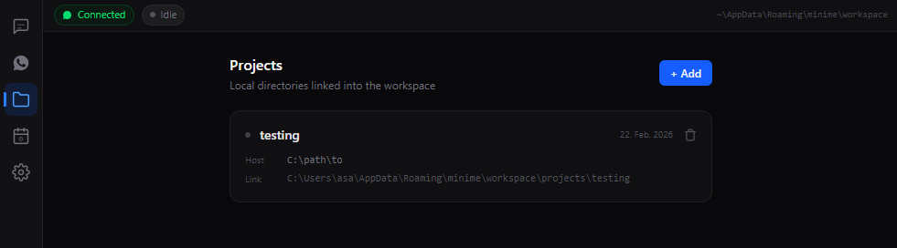
</p>

Claude Code can technically reach any folder on your machine — but the agent doesn't know about them. **Link Projects** makes a folder visible inside the workspace so the agent can find it, navigate to it, and work on it across sessions. It also tracks each project in its memory (structure, tech stack, open tasks).

Go to **Projects** > **+ Add** and select a folder. A directory junction appears in the workspace, and the agent can read files, write code, run tests, and execute commands inside it.

## Scheduled Tasks

<p align="center">
  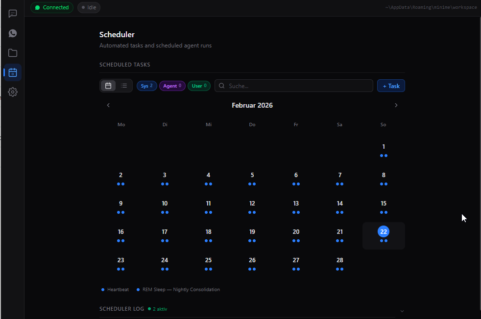
</p>

Two system tasks run automatically:

| Task | Schedule | Purpose |
|------|----------|---------|
| **Heartbeat** | Every few hours (07:00–23:00) | Agent checks for pending items, new files, deadlines |
| **REM Sleep** | Daily at 03:00 | Nightly memory consolidation and planning |

Create your own with **+ Task**. The agent can also create tasks on its own.

<p align="center">
  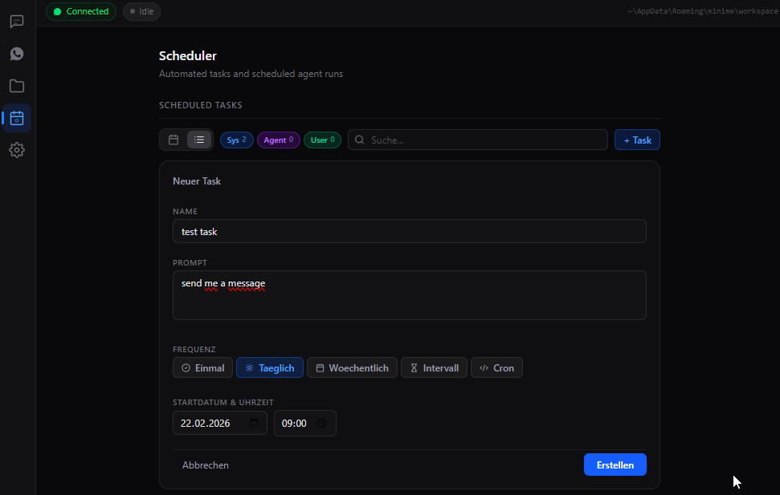
</p>

## Workspace = Claude Code's cwd

The workspace is the agent's working directory. Everything Claude Code normally reads from the current folder — `CLAUDE.md`, `.claude/settings.json`, `.claude/skills/`, MCP servers, hooks — lives here and works exactly the same way.

This means you can extend the agent like you'd configure any Claude Code project:

- **Add skills** in `.claude/skills/` — the agent picks them up
- **Edit `CLAUDE.md`** to change instructions, rules, or behavior
- **Configure MCP servers** in `.mcp.json` — same as on your machine
- **Add hooks** in `.claude/settings.json` — pre/post tool execution
- **Change `settings.json`** for allowed tools, permissions, model preferences

Open the workspace in VS Code or any editor. Changes take effect on the next conversation.

## Memory

The agent builds persistent memory in the workspace — structured files it reads and updates across sessions:

```
workspace/
├── CLAUDE.md            # Main instructions (read by Claude Code)
├── SOUL.md              # Agent identity and communication style
├── HEARTBEAT.md         # Proactive check instructions
├── .claude/
│   ├── settings.json    # Claude Code settings (permissions, hooks, etc.)
│   └── skills/          # Skills (same as Claude Code skills)
├── memory/
│   ├── CLAUDE.md        # Memory index — routing table for all knowledge
│   ├── user/            # What it knows about you
│   ├── people/          # People in your life
│   ├── projects/        # Project knowledge
│   └── journal/         # Weekly notes & tasks
└── projects/            # Linked project directories
```

### How memory is connected

Claude Code has a limited context window. The agent can't load everything at once — so the memory is organized as a network of linked files, loaded in tiers:

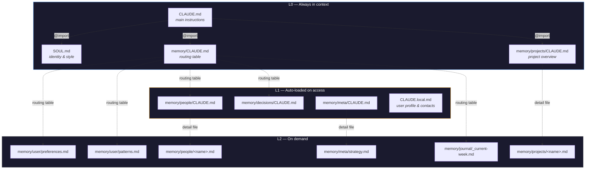

**How it works:** `CLAUDE.md` uses `@`-references to pull `SOUL.md`, `memory/CLAUDE.md`, and the project index into every session automatically. The memory index acts as a **routing table** — it maps topics to files with trigger keywords, so the agent knows where to look without loading everything. Each folder's `CLAUDE.md` auto-loads when the agent works in that folder.

### When the agent learns

The agent doesn't save things randomly — three mechanisms ensure nothing important gets lost:

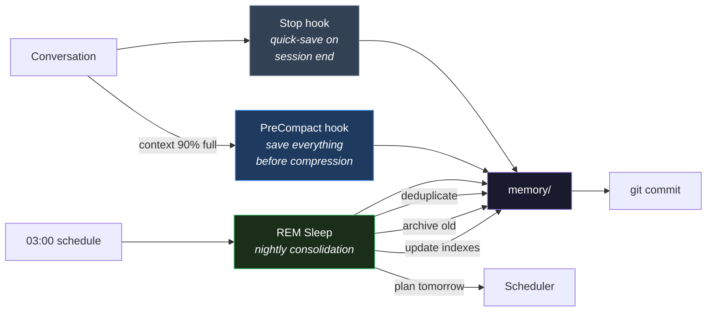

| Trigger | When | What happens |
|---------|------|-------------|
| **PreCompact** | Context window ~90% full | Claude Code is about to compress older messages to free up space. Right before that, this hook fires — the agent writes down insights, decisions, and open work so nothing gets lost in the compression. |
| **Stop** | Session ends | Quick-save: the agent checks if anything worth remembering came up (max 1-2 entries). |
| **REM Sleep** | Nightly at 03:00 | Full maintenance: deduplicate knowledge, archive completed projects, update all indexes, apply decay rules (remove stale entries), review strategy, and plan the next day. |

All memory changes are git-tracked if git is enabled, so nothing is ever truly lost.

---

# Settings

<p align="center">
  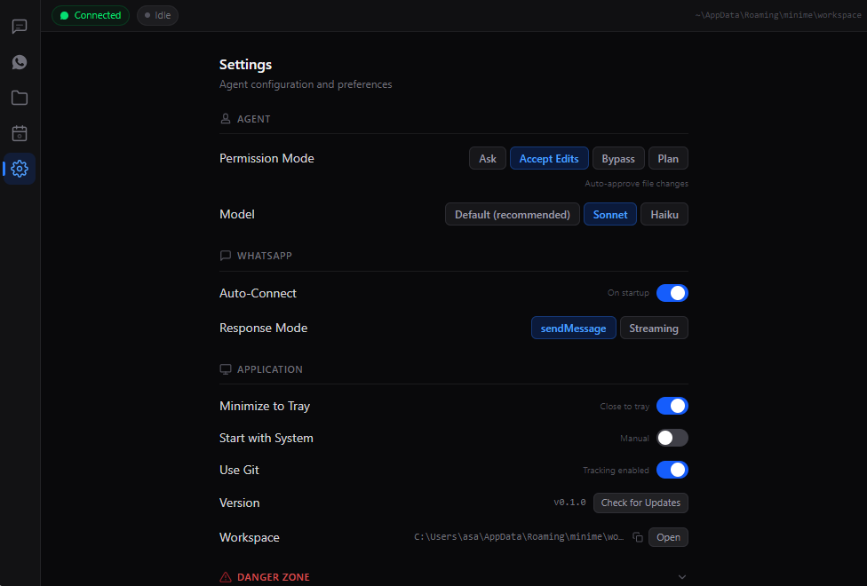
</p>

| Section | Setting | What it does |
|---------|---------|-------------|
| **Agent** | Permission Mode | Ask / Accept Edits / Bypass / Plan |
| **Agent** | Model | Default, Sonnet, or Haiku |
| **WhatsApp** | Auto-Connect | Connect WhatsApp automatically on startup |
| **WhatsApp** | Response Mode | sendMessage (deliberate) or Streaming (real-time) |
| **App** | Minimize to Tray | Close button hides to tray instead of quitting |
| **App** | Start with System | Launch on login |
| **App** | Use Git | Track workspace and project changes with git |

**Danger Zone** (bottom of Settings) lets you reset individual components or everything.

---

# Schnellstart

## 1. Claude Code installieren

miniMe nutzt [Claude Code](https://code.claude.com/docs/en/setup) im Hintergrund. Zuerst installieren:

**Windows PowerShell:**
```powershell
irm https://claude.ai/install.ps1 | iex
```

**macOS / Linux / WSL:**
```bash
curl -fsSL https://claude.ai/install.sh | bash
```

Dann authentifizieren:
```bash
claude
```

Einloggen mit [Claude Pro/Max](https://claude.ai/pricing) Account oder [Anthropic API Key](https://console.anthropic.com/).

## 2. miniMe installieren

Neuestes Release herunterladen:

- **Windows**: `minime-x.x.x-setup.exe`
- **Linux**: `minime-x.x.x-x64.AppImage` oder `.deb`

Oder selbst bauen:
```bash
git clone https://github.com/sabania/miniMe.git
cd miniMe
npm install
npm run build:win    # oder build:linux
```

Beim ersten Start Sprache waehlen (Deutsch / English) — das legt die Templates und den Kommunikationsstil des Agents fest.

## 3. WhatsApp verbinden

<p align="center">
  
</p>

**Connect** im WhatsApp-Tab klicken. QR-Code erscheint.

Auf dem Handy: **WhatsApp** > **Verknuepfte Geraete** > **Geraet verknuepfen** > QR-Code scannen.

<p align="center">
  
  &nbsp;&nbsp;
  
  &nbsp;&nbsp;
  
</p>

Fertig. Nachricht schreiben, Agent antwortet.

<p align="center">
  
</p>

---

# Es ist einfach Claude Code

miniMe erfindet nichts neu. Es laeuft dasselbe Claude Code das du schon im Terminal nutzt — mit dem gleichen Permission-System, den gleichen CLAUDE.md-Dateien, den gleichen Skills, den gleichen Einstellungen.

**Was miniMe dazu gibt:**
- **WhatsApp-Zugang** — schreib deinem Agent vom Handy
- **Geplante Tasks** — der Agent kann nach Zeitplan arbeiten (Heartbeat, naechtliche Konsolidierung)
- **Persistente Sessions** — auf WhatsApp starten, am PC weitermachen
- **Desktop-App** — Permissions, Sessions und Projekte ueber eine UI verwalten

**Was gleich bleibt:**
- Claude Codes Permission-System (settings.json, Allow/Deny-Rules)
- CLAUDE.md-Dateien im Workspace — der Agent liest sie wie jede Claude Code Session
- Skills in `.claude/skills/` — funktioniert exakt wie auf deinem Rechner konfiguriert
- Alle Tools (WebSearch, Bash, Read, Write, Edit, etc.) — wie in der CLI

Du kannst den Workspace-Ordner oeffnen, CLAUDE.md bearbeiten, Skills hinzufuegen, settings.json aendern — alles funktioniert wie Claude Code normal konfigurieren. Der Agent uebernimmt es beim naechsten Lauf.

---

# Was miniMe dazu gibt

## WhatsApp-Nachrichten

Schreib dem Agent vom Handy. Die Sessions-UI zeigt die komplette Konversation, Kosten und Status — aber WhatsApp ist wo du mit ihm redest.

<p align="center">
  
</p>

## Permissions steuern

Wenn der Agent ein Tool nutzen will, fragt er — via WhatsApp oder Desktop-UI. Du entscheidest.

<p align="center">
  
  &nbsp;&nbsp;
  
</p>

<p align="center">
  
</p>

Der **Permission Mode** steuert wie viel Autonomie der Agent hat:

| Modus | Verhalten |
|-------|-----------|
| **Ask** | Agent fragt vor jeder Tool-Nutzung — volle Kontrolle |
| **Accept Edits** | Datei-Edits auto-genehmigt, andere Tools fragen |
| **Bypass** | Voll autonom — keine Prompts |
| **Plan** | Nur lesen — Agent kann nicht aendern |

Das ist dasselbe Permission-System wie Claude Code. `Bypass` ist wie `claude --dangerously-skip-permissions`. `Ask` ist der Standard-Modus. Du hast die Kontrolle.

## Am PC weitermachen

Jede Session hat ein Arbeitsverzeichnis und eine Session-ID. Klick **Terminal** in der UI und Claude Code oeffnet sich im Terminal — setzt exakt dieselbe Session fort. **Code** oeffnet VS Code. **Files** oeffnet den Workspace.

Starte einen Task vom Handy, setz dich an den PC, mach mit vollem Kontext weiter.

## Projekte einbinden

<p align="center">
  
</p>

Claude Code kann technisch jeden Ordner auf deinem Rechner erreichen — aber der Agent weiss nichts davon. **Link Projects** macht einen Ordner im Workspace sichtbar, sodass der Agent ihn finden, dorthin navigieren und ueber Sessions hinweg darin arbeiten kann. Ausserdem trackt er jedes Projekt im Gedaechtnis (Struktur, Tech-Stack, offene Punkte).

**Projects** > **+ Add** und einen Ordner waehlen. Eine Directory Junction erscheint im Workspace, und der Agent kann darin Dateien lesen, Code schreiben, Tests ausfuehren und Befehle starten.

## Geplante Tasks

<p align="center">
  
</p>

Zwei System-Tasks laufen automatisch:

| Task | Zeitplan | Zweck |
|------|----------|-------|
| **Heartbeat** | Alle paar Stunden (07:00–23:00) | Agent prueft offene Punkte, neue Dateien, Deadlines |
| **REM Sleep** | Taeglich um 03:00 | Naechtliche Konsolidierung und Planung |

Eigene Tasks erstellen mit **+ Task**. Der Agent kann auch selbst Tasks anlegen.

<p align="center">
  
</p>

## Workspace = Claude Codes cwd

Der Workspace ist das Arbeitsverzeichnis des Agents. Alles was Claude Code normalerweise aus dem aktuellen Ordner liest — `CLAUDE.md`, `.claude/settings.json`, `.claude/skills/`, MCP-Server, Hooks — liegt hier und funktioniert exakt gleich.

Das heisst du kannst den Agent erweitern wie jedes Claude Code Projekt:

- **Skills hinzufuegen** in `.claude/skills/` — der Agent nutzt sie
- **`CLAUDE.md` bearbeiten** um Anweisungen, Regeln oder Verhalten zu aendern
- **MCP-Server konfigurieren** in `.mcp.json` — wie auf deinem Rechner
- **Hooks einrichten** in `.claude/settings.json` — vor/nach Tool-Ausfuehrung
- **`settings.json` aendern** fuer erlaubte Tools, Permissions, Model-Praeferenzen

Oeffne den Workspace in VS Code oder einem beliebigen Editor. Aenderungen greifen bei der naechsten Konversation.

## Gedaechtnis

Der Agent baut ein persistentes Gedaechtnis im Workspace auf — strukturierte Dateien die er ueber Sessions hinweg liest und aktualisiert:

```
workspace/
├── CLAUDE.md            # Haupt-Anweisungen (von Claude Code gelesen)
├── SOUL.md              # Agent-Identitaet und Kommunikationsstil
├── HEARTBEAT.md         # Anleitung fuer proaktive Checks
├── .claude/
│   ├── settings.json    # Claude Code Settings (Permissions, Hooks, etc.)
│   └── skills/          # Skills (wie Claude Code Skills)
├── memory/
│   ├── CLAUDE.md        # Gedaechtnis-Index — Routing-Tabelle fuer alles Wissen
│   ├── user/            # Was er ueber dich weiss
│   ├── people/          # Personen in deinem Leben
│   ├── projects/        # Projekt-Wissen
│   └── journal/         # Woechentliche Notizen & Tasks
└── projects/            # Verlinkte Projekt-Verzeichnisse
```

### Wie das Gedaechtnis vernetzt ist

Claude Code hat ein begrenztes Context-Fenster. Der Agent kann nicht alles gleichzeitig laden — deshalb ist das Gedaechtnis als Netzwerk verlinkter Dateien organisiert, in Stufen geladen:


**So funktioniert's:** `CLAUDE.md` zieht ueber `@`-Referenzen `SOUL.md`, `memory/CLAUDE.md` und den Projekt-Index automatisch in jede Session. Der Memory-Index ist eine **Routing-Tabelle** — er mappt Themen auf Dateien mit Trigger-Keywords, sodass der Agent weiss wo er nachschauen muss ohne alles zu laden. Jede `CLAUDE.md` in einem Ordner wird automatisch geladen wenn der Agent dort arbeitet.

### Wann der Agent lernt

Der Agent speichert nicht zufaellig — drei Mechanismen sorgen dafuer, dass nichts Wichtiges verloren geht:

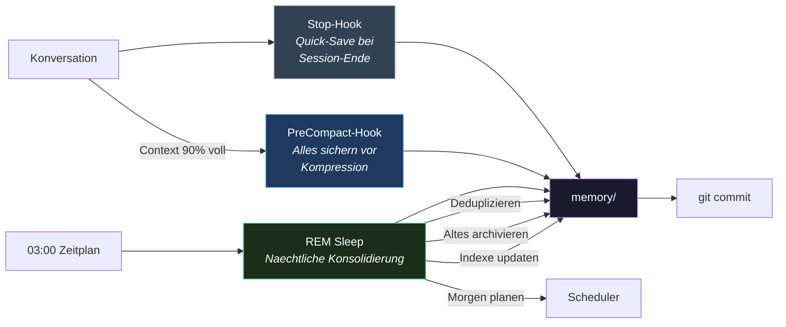

| Trigger | Wann | Was passiert |
|---------|------|-------------|
| **PreCompact** | Context-Fenster ~90% voll | Claude Code komprimiert gleich aeltere Nachrichten um Platz zu schaffen. Kurz vorher feuert dieser Hook — der Agent schreibt Erkenntnisse, Entscheidungen und offene Arbeit auf, damit nichts bei der Kompression verloren geht. |
| **Stop** | Session endet | Quick-Save: Agent prueft ob etwas Merkenswertes passiert ist (max 1-2 Eintraege). |
| **REM Sleep** | Naechtlich um 03:00 | Volle Wartung: Wissen deduplizieren, abgeschlossene Projekte archivieren, alle Indexe updaten, Decay-Regeln anwenden (veraltete Eintraege entfernen), Strategie reviewen und den naechsten Tag planen. |

Alle Gedaechtnis-Aenderungen sind git-getrackt wenn Git aktiviert ist — nichts geht wirklich verloren.

---

# Einstellungen

<p align="center">
  
</p>

| Bereich | Einstellung | Was es tut |
|---------|-------------|-----------|
| **Agent** | Permission Mode | Ask / Accept Edits / Bypass / Plan |
| **Agent** | Model | Default, Sonnet oder Haiku |
| **WhatsApp** | Auto-Connect | WhatsApp automatisch verbinden beim Start |
| **WhatsApp** | Response Mode | sendMessage (ueberlegt) oder Streaming (Echtzeit) |
| **App** | Minimize to Tray | Schliessen minimiert in den Tray |
| **App** | Start with System | Automatisch starten beim Login |
| **App** | Use Git | Workspace- und Projekt-Aenderungen tracken |

**Danger Zone** (unten in Settings) zum Zuruecksetzen einzelner Komponenten oder alles.
